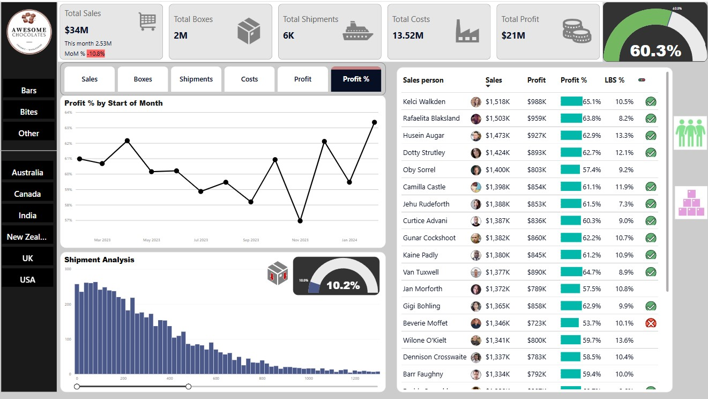

# Awesome_Chocolate_PowerBI

This project features an interactive Power BI dashboard developed for "Awesome Chocolates," a fictional confectionery company. The dashboard offers a comprehensive analysis of sales performance, shipment metrics, costs, and profit distribution across regions, products, and sales representatives.

 Dashboard Overview

The dashboard answers key business questions such as:
- How are monthly sales and profits trending?
- Which products or regions are most profitable?
- Who are the top-performing salespeople?
- What is the shipment distribution and efficiency?

 Tools & Technologies
- POWER BI – Data modeling and visualization
- EXCEL – Data source (sales, shipments, dimensional data)
- DAX – For calculated measures like % Profit and LBS %

You can view the full dashbaord here - [App Power BI link](https://app.powerbi.com/reportEmbed?reportId=4031675a-90d0-417e-a238-aa31b794e2ef&autoAuth=true&ctid=7bd08b0b-3395-4dc1-94bb-d0b2e56a497f)

